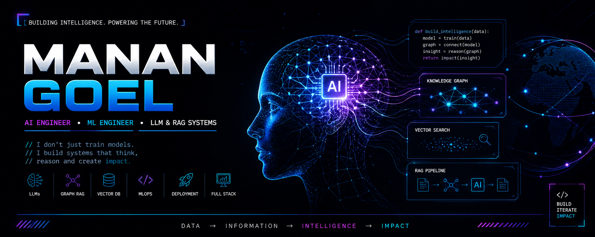

<div align="center">



<br/>

<h1>
  
</h1>

<p>
  <strong>Systems Engineer</strong> working at the intersection of  
  <strong>Graph Intelligence, Reinforcement Learning, and Agentic AI</strong>  
</p>

<p>
  Bridging <strong>research → production systems</strong> with scalable AI pipelines
</p>

<p>
  <a href="https://huggingface.co/J1n-x"></a>
  <a href="mailto:manangoel682@gmail.com"></a>
  <a href="https://www.linkedin.com/in/manan-goel-711340251/"></a>
</p>

</div>

---

## ⚡ SYSTEM FLOW

<p align="center">
  
</p>

---

## 🧬 Engineering Philosophy

> AI is a systems problem, not just a modeling problem.
> True intelligence = memory (graphs) + reasoning (agents) + action (RL)

---

## 🛠️ The Technology Ecosystem

<table width="100%">
  <tr>
    <td width="33%">
      <h3>🚀 SDE Fundamentals</h3>
      DSA • OOP • System Design • Async Programming
    </td>
    <td width="33%">
      <h3>💻 Programming</h3>
      Python • C++ • Java • SQL • JavaScript
    </td>
    <td width="33%">
      <h3>📊 Data & DBs</h3>
      Neo4j • FAISS • PostgreSQL • Firebase • Pandas
    </td>
  </tr>
  <tr>
    <td>
      <h3>🧠 AI / ML Core</h3>
      PyTorch • TensorFlow • NLP • CV • RL • GraphRAG
    </td>
    <td>
      <h3>⛓️ Specialized AI</h3>
      LLMs • Agentic AI • Multimodal AI • MediaPipe
    </td>
    <td>
      <h3>🛡️ Engineering / Ops</h3>
      FastAPI • Docker • CI/CD • REST APIs • Deployment
    </td>
  </tr>
</table>

---

## 🚀 Featured Intelligence Systems

### 🪞 Darpan — Global Intelligence Engine

Graph RAG system combining Neo4j + FAISS for multi-hop reasoning and signal detection

### 🧠 Green Data Center RL

Autonomous optimization system balancing energy, thermal comfort, and carbon

### 🧬 Shravana — AI Healthcare

Multi-task learning + real-time posture correction + monitoring

### 🌱 EcoFinds — Sustainability AI

NLP + CV system for eco-product discovery

---

## 🟢 SYSTEM STATUS

```diff
+ Intelligence Engine: ACTIVE
+ Model Pipelines: RUNNING
+ Data Ingestion: LIVE
+ Deployment: CONTINUOUS
```

---

## 📊 GitHub Analytics

<p align="center">
  
  
</p>

<p align="center">
  
</p>

---

## 🔭 Current Focus

* Agentic AI systems
* Graph-based reasoning
* High-performance AI infra

---

<p align="center">
  
</p>
